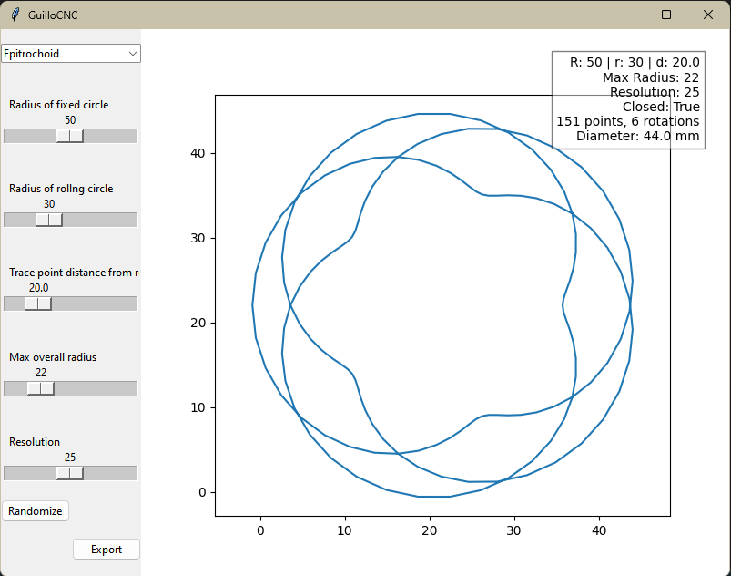

# 12 July, 2024

Today, I will be continuing the work I started yesterday on the shape dropdown as well as starting work on the implementation of a .gcode exporter. Specifically, I hope to export gcode files that are compatible with the Roland SRM-20 mini-mill.

So, the objectives (rolling over from yesterday) are:
- Implement a dropdown menu that allows the user to switch the type of curve being generated
- Implement a .gcode exporter
- Explore methods to set line width based on a user-configured cut width

## Implement a .gcode exporter
### Pre-programming
This will (hopefully) be an easy feature to implement, as I've already successfully written code that will export shapes generated using Spyrograph to the Roland SRM-20 mini-mill as well as a Haas VF-1 CNC machine. All I really need to do is bring that code over from my notebook and tie it to a button.
### Programming
As I started to program, I realized that I'll need to familiarize myself with envoking a file explorer dialog in order to save the files where I want them to go. 

I am now halfway through coding the code to write to the file and I strongly believe that it is a good idea that I implement the global shape variable. To save myself any hairpulling, I will NOT be doing that at this time, but it is now very high on my list of things to do. Maybe I'll find myself with no other option within the next hour or so.

Button is in! I can fix the layout later.

Now that a basic function is implemented, lets export a file. I'll plug the file into NC Viewer and make sure the machine won't mill into the base platform.

The preview looks frickin' great! Lets get it into the Roland.

***TODO insert pics of cut 1 here***

So, a few things that happened during the first run:
- I had to adjust the Z origin of G54 through the machine's software. Complete user error there.
- It runs **extremely** slow (20 mm/min)
- It stopped part of the way through cutting and restarted

I'll look for ways to address these issues in the code.

For one, I put the machine into metric mode (``G21``), and then expected it to mill at a depth of -0.005" (``G01 Z-0.005 F8.``). This must also affect the movement speeds. For now, I will implement a conversion from millimeters to inches into the coordinate cleaning loop and set the machine to use inches (``G20``). 

I have moved the origin point a bit to the right, and now it is time to try again.

***TODO insert pics of cut 2 here***

Here are my takeaways from the second cut:
- Runs at the proper speed, proving my ``G20`` vs ``G21`` suspicions
- The sizing is still correct, meaning the conversion formula is correct
- No restarting occured. The issue last time could have been a fluke.

In terms of things unrelated to the software:
- Due to the material being slightly bowed, the cut depth is not uniform.
- The top layer of the material is burring. This might be due to wear on the tool. 

### Post-programming

I think I've made it far enough with this feature for today. There are a few ways that I can make this feature better, as well as some things I would love to implement for myself:
- After I implement layering into the program, maybe I could have a utility that would automatically create a path that could "punch out" a watch dial.
- I think that implementing a set of transformation tools would be hugely beneficial. Rotation, scaling, location, and maybe even depth at some point.
- I need to add the configuration of the shape into the filename, gcode, or metadata.
- For the Roland machine, I need to look into sending the machine to its 'view' position, rather than sending it home.

After having to configure the same shape a handful of times after each time I changed the code, I do think it is important to implement an entry field next to each slider, as well as an import-export feature. I'll try to do the entry field thing today.

## Implement a dropdown menu that allows the user to switch the type of curve being generated
### Pre-programming
So it has just occured to me that not only does a global ``shape`` variable need to be defined, but a new ``get_shape()`` function must be created to handle the logic that needs to be done here. Also, while I'm already making a new variable, now would be a good time to make a global variable for each of the ``R``, ``r``, ``d``, ``max_radius``, and ``resolution`` sliders. That should make the implementation of a syncronized input box possible. I'm going to try my best to stick to working on my proposed function.

### Programming
Creating the ``get_hypotrochoid()`` function was as simple as copying my preexisting ``get_epitrochoid()`` function and changing it slightly. I then created ``get_shape()`` to handle the ``selected_shape`` logic with an ``if`` statement, only to realize that I could just write the ``if`` statement inside of ``update_plot()`` since that function already gets the values from the ``R``, ``r``, ``d``, ``max_radius``, and ``res`` sliders. I'll just comment the ``get_shape()`` function out.

It's alive! But, of course, with a few things to note:
- The infobox (top right) is showing ``PY_VAR0`` instead of ``Hypotrochoid``
- The combobox cannot be deselected
- When the value in the combobox is changed, the plot only updates to the correct shape after a slider is changed
- The exported shape is still an epitrochoid, but that is because ``export_gcode()`` defines ``shape = get_epitrochoid(...)``. Therefore, the ``get_shape()`` function is needed.

*Sidenote: I have been wondering "when is the right time to save and commit changes?" and I've come to the conclusion that maybe I should commit each time I stop to add to the daily entry. Just food for thought.*

I am going to take the time now to implement the global shape parameters, as well as a global shape variable. I don't know if this will help the program run any smoother, but it is probably worth a shot.

Also, on the topic of changing which sliders are visible depending on which shape type is selected, there must be a way for me to store an array of possible shapes and the arguments that they require. Based on the shape type selected by the user, the program can generate the proper sliders.

After moving some things around and creating the global configuration variables, I have run into an issue where I cannot call global variables inside of a function on another thread. I've undone my changes there, but I am inclined to say that I am at a good stopping spot for today. 

## Final Thoughts
As I was working on the dropdown menu, I kept "daydreaming" of what I want the GUI to look like down the line. Sometime soon, I will sit down and draw out a wireframe. I probably should do some research on different programs that serve a similar purpose. Or maybe look at a few that have nothing to do with what I'm doing. Only time will tell.